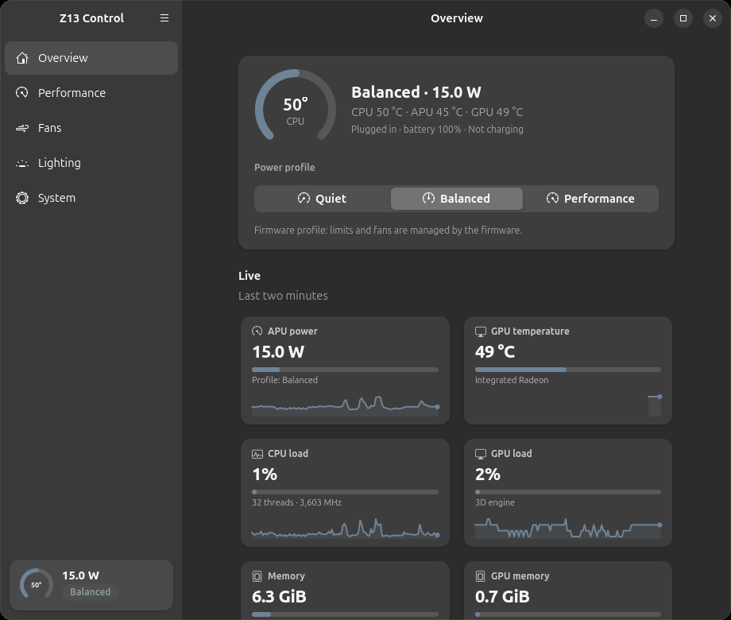
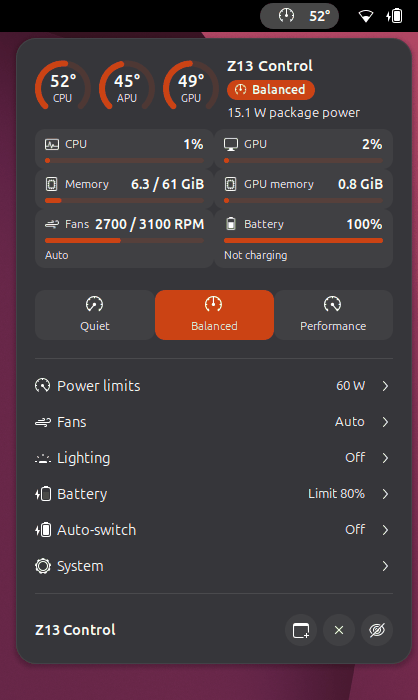
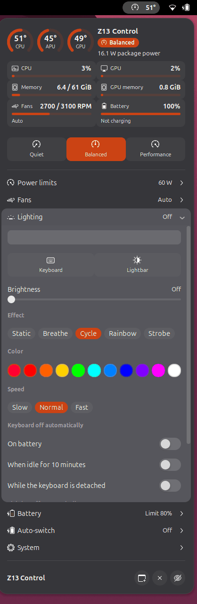
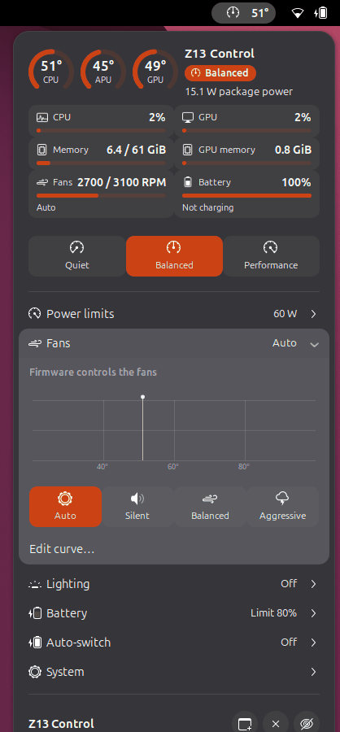
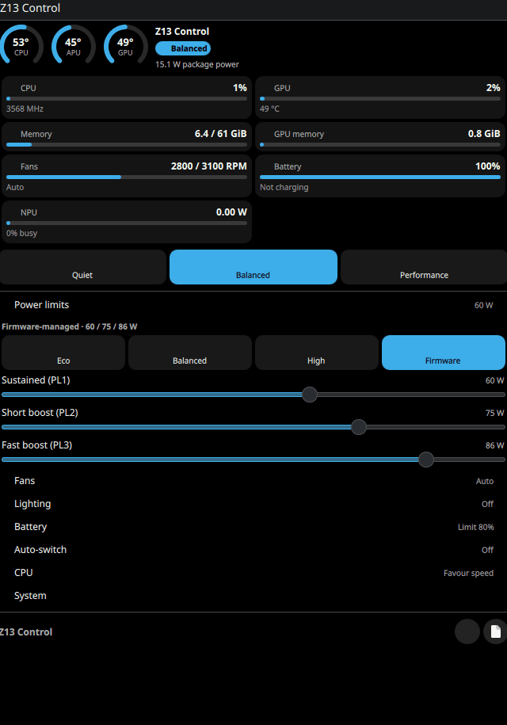
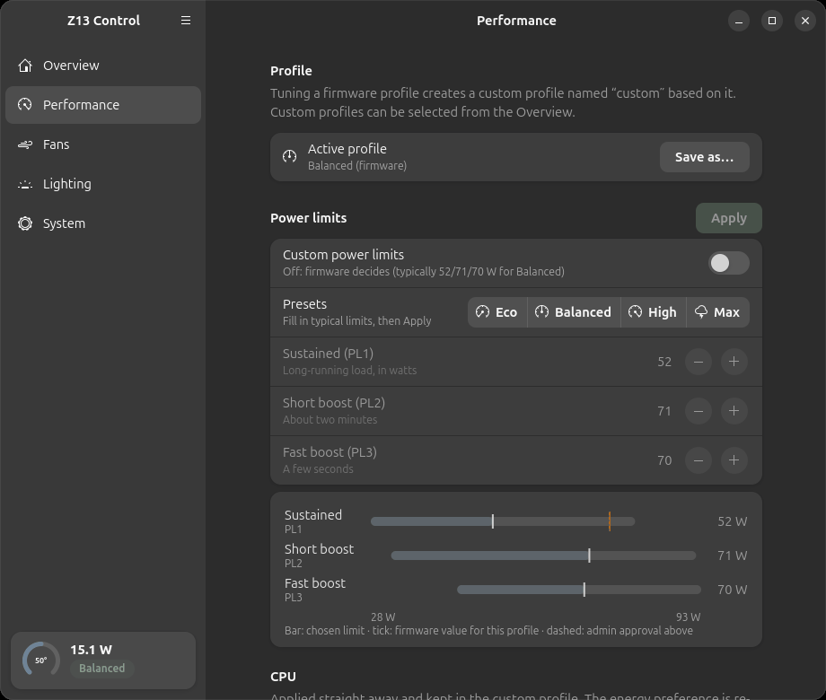
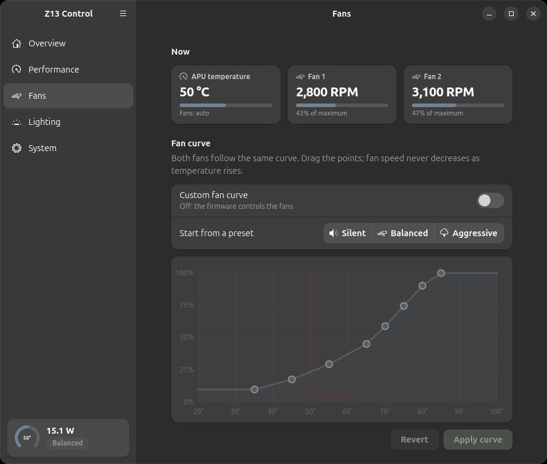
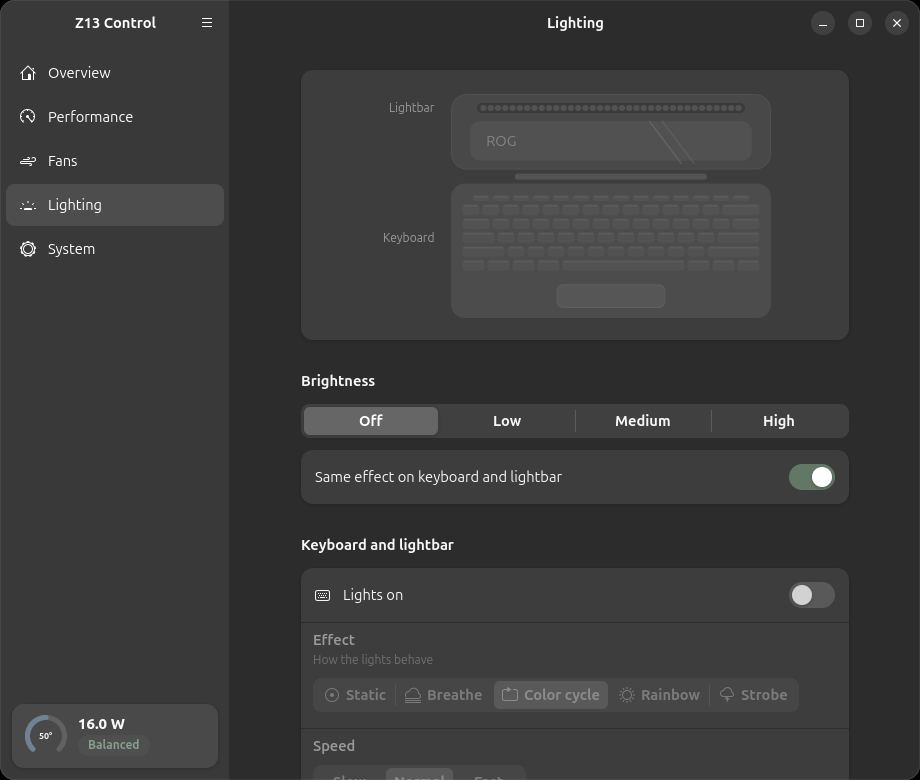
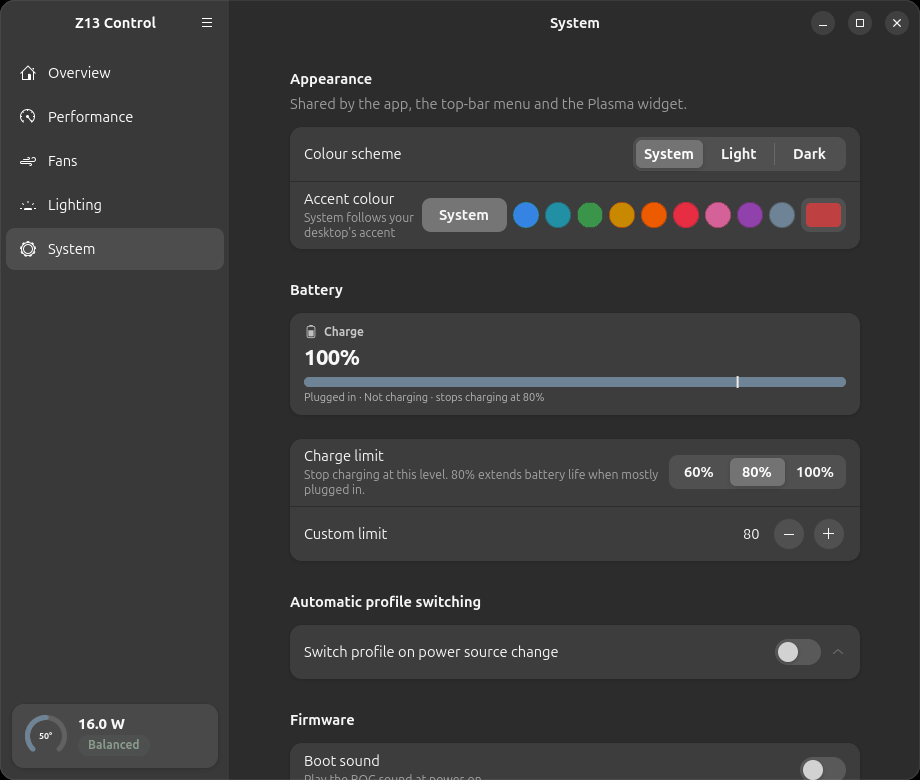

# Z13 Control

Hardware control for the **2025 ASUS ROG Flow Z13** (GZ302E) on Linux: power
profiles, APU power limits, fan curves, keyboard and lightbar RGB, battery
charge limit, live monitoring and firmware toggles.

An app, a panel menu for **GNOME** and **KDE Plasma**, and a `z13`
command-line tool, all talking to a small system service that holds the
privileges so nothing else has to.



## Install

One line, on Ubuntu 24.04+, Fedora 42+, or Arch-based systems such as
CachyOS (GNOME or KDE Plasma 6):

```sh
curl -fsSL https://raw.githubusercontent.com/wabibito/z13-control/main/install.sh | sh
```

It picks the right package for your system, asks for your password once, and
starts the service. Or download the package from [Releases](../../releases)
and install it by hand:

```sh
sudo apt install ./z13-control_*_all.deb              # Ubuntu / Debian
sudo dnf install ./z13-control-*.noarch.rpm           # Fedora / RHEL
sudo pacman -U ./z13-control-*-any.pkg.tar.zst        # Arch / CachyOS / EndeavourOS
```

**Log out and back in once after installing.** GNOME only picks up the top-bar
menu at login; the app enables it for you. On KDE Plasma the app adds its
widget to your panel the first time it starts.

## What it does

### Live monitoring

APU temperature and power, CPU and GPU load, RAM and GPU memory, NPU power, fan
speeds and battery, each with a two-minute graph that is already filled in when you open
the app, because the service records it continuously.

### Top-bar menu



Temperature in the top bar, and one click away, a dashboard: a ring gauge for
the APU temperature, the active profile as a badge, and tiles with bars for CPU
and GPU load, memory, GPU memory, fan speeds and battery that turn amber and
red as things heat up. Below it, profile buttons, power limits and fan presets,
lighting, battery limit, auto-switch, alerts and the panel refresh rate —
without opening the app. It follows your accent colour and light or dark style.




Each panel opens in place: lighting with a preview strip and per-zone
switch-off rules, fans with the curve and the live temperature marked.

### KDE Plasma panel widget



The same dashboard and controls as a Plasma 6 widget, following your Plasma
theme and accent colour.
It is placed on your panel automatically; right-click the panel → *Add
Widgets* → *Z13 Control* to add it again after removing it. Refresh-rate
switching uses KScreen on Plasma.

### Profiles and power limits



**Quiet, Balanced and Performance** are the firmware's own profiles, shared with
GNOME's power menu. Build **custom profiles** on top of them with their own
power limits, fan curve and CPU settings (energy preference, minimum clock and
boost), and switch automatically when you plug in or unplug.

Power limits use the kernel's own interface and the per-model range it reports,
so values your machine would reject are refused up front. Sustained power above
75 W asks for an administrator password and enforces a fan floor.

### Fans



Drag the eight points, or start from Silent, Balanced or Aggressive. The curve
is re-applied automatically if something else drops it, the current temperature
is marked on the graph, and at high sustained power the enforced minimum is
drawn in orange: your points are raised to it, never lowered.

### Lighting



Keyboard and lightbar, together or separately: static, breathe, colour cycle,
rainbow or strobe, with colour, speed and brightness, and a live preview. Each
zone can switch itself off on battery, after a period of inactivity, or while
the keyboard is detached, with its own rules for the keyboard and the lightbar,
and your colours come back when the condition clears.

### System



Battery charge limit, automatic profile switching, boot sound, panel overdrive
(remembered across reboots, optionally off on battery), panel refresh rate (with
an optional drop to 60 Hz on battery), alerts when the APU stays hot, and
export/import of your profiles and settings.

**Appearance.** Light, dark or the system's scheme, and an accent colour: the
desktop's own, one of nine, or any colour you pick. The app, the top-bar menu
and the Plasma widget all follow it.

**Tablet mode.** Pull the keyboard off and, with the option on, the desktop
rotates and brings up the on-screen keyboard: Z13 Control reports tablet mode
itself from whether the keyboard is attached, because the firmware's own switch
is unreliable. The keyboard's touchpad can be switched off if its cursor jumps,
and that choice survives reattaching it.

### Staying up to date

The app checks for new releases once a day and can install them for you:
**System → Updates → Install update**, with a single password prompt. From a
terminal, `z13 update` does the same.

### Command line

```sh
z13 status                      # everything at a glance
z13 monitor                     # live temperature / power / fans
z13 use performance             # switch profile
z13 tdp 65 80 90                # power limits in watts
z13 cpu --epp power --boost off # CPU energy preference and boost
z13 fan set balanced            # fan preset or your own 8 points
z13 light -m breathe -c cyan --color2 blue
z13 battery 80                  # charge limit
z13 tablet --switch on          # tablet mode when the keyboard is detached
z13 theme --accent teal --scheme dark   # or --accent system
z13 export my-profiles.json     # back up profiles and settings
z13 history usage.csv           # recorded telemetry as CSV
```

`z13 --help` lists everything.

## How it is put together

A root service owns the hardware and authorises every change through polkit, so
no system files or devices are made writable for ordinary users. Everyday
changes are allowed for the person sitting at the machine; raising sustained
power above 75 W asks for an administrator password.

Profile switches go through power-profiles-daemon, so GNOME's power menu, the
CPU's energy setting and the firmware stay in agreement, and changes made from
that menu or with Fn+F5 are followed rather than fought.

Before sleep the lights go off, power is lowered if needed and the fans are
handed back to the embedded controller so they can stop; everything is restored
after resume.

## Requirements

* 2025 ROG Flow Z13 (GZ302E)
* Ubuntu 24.04+, Fedora 42+ or an Arch-based distribution (CachyOS,
  EndeavourOS, Manjaro), with GNOME or KDE Plasma 6 (Wayland or X11)
* Linux 6.11+ for fan curves and power limits; 6.19+ reports the per-model
  power range this app uses

## What's new

**0.1.1**

* The top-bar menu is a visual dashboard: a temperature ring, gauge tiles for
  load, memory, fans and battery, profile buttons, a drawn fan curve with the
  live temperature, a lighting preview and a battery gauge, all in your accent
  colour. The temperature in the top bar turns red when the APU reaches 90 °C.
* Custom profiles can set the CPU's energy preference, minimum clock and
  boost, kept in force even when the desktop rewrites them.
* NPU power and load on the Overview.
* Uninstall from inside the app (System → Remove), with one password prompt.
* Automatic switch-off rules are separate for the keyboard and the lightbar.
* Theme: light or dark scheme and an accent colour shared by the app, the
  top-bar menu and the widget (System → Appearance, or `z13 theme`).
* The app has the same look: an APU gauge and profile switch at the top of
  the Overview, gauge tiles everywhere, the three power limits drawn against
  the kernel's range, live fan tiles and a battery gauge, plus a status block
  in the sidebar.
* Tablet mode: report it to the desktop when the keyboard is detached, and
  switch the keyboard touchpad off if its cursor jumps.
* Auto-switch picks the right profile at boot for the current power source.
* Panel overdrive is remembered across reboots and can be off on battery.
* Lighting comes back when the lid is opened, and a double-reported press of
  the Armoury Crate key no longer opens and closes the app.

**0.1.0** — First release.

## Uninstall

From the app: **System → Remove → Uninstall…** removes everything after one
password prompt, optionally with your saved profiles. Or from a terminal:

```sh
sudo apt remove z13-control     # Ubuntu / Debian
sudo dnf remove z13-control     # Fedora / RHEL
sudo pacman -R z13-control      # Arch / CachyOS
```

Saved profiles stay in `/var/lib/z13-control`.

## License

Copyright 2026 NA Research. Licensed under Apache-2.0 (see LICENSE and NOTICE).
